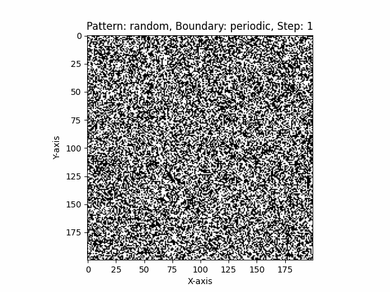
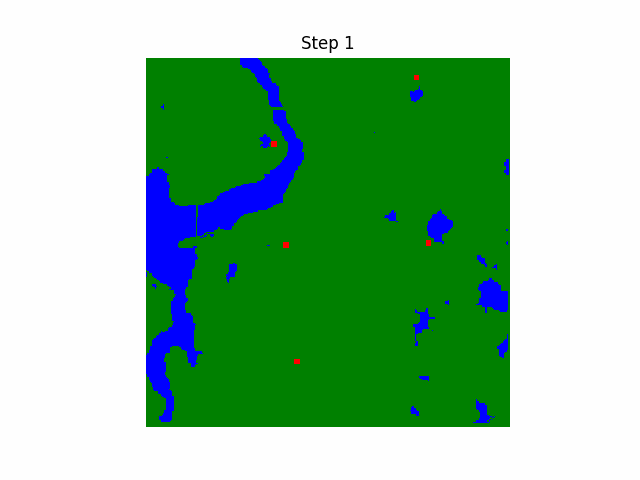

# Discrete Modeling

## LAB_01
This directory contains Python code for performing basic image processing tasks such as darkening, brightening, and binary thresholding using the Pillow library. The darkening function reduces the image's brightness by a user-defined percentage, while the brightening function generates multiple images with incremental brightness increases. The binary thresholding function converts the image to a binary format based on a fixed or user-defined threshold. Users can dynamically adjust the threshold during runtime to explore different binary outcomes. The code allows easy manipulation of grayscale images and saving the results to files.

## LAB_02
The directory contains an implementation of contextual and morphological transformations in Python. It includes functions for dilation, erosion, opening, closing, and convolution operations with masks of varying radii. The code also supports loading masks from files and saving transformation results as image files.

## LAB_03
The code implements a one-dimensional cellular automaton that evolves based on a set of rules derived from an album number. It supports both periodic and absorbing boundary conditions and saves the resulting automaton states to a CSV file. The user inputs the number of iterations and the boundary condition type, and the program simulates successive generations of the automaton

## LAB_04
This project implements Conway's Game of Life using Python, NumPy, and Matplotlib. It supports two boundary conditions: periodic and reflecting, affecting how cells interact at the edges. The simulation starts with an initial grid containing predefined patterns such as gliders, oscillators, still life, or a random configuration. The grid evolves over a set number of steps according to the Game of Life rules. Each step updates the state based on the number of neighboring alive cells. Animated GIFs are generated for each pattern and boundary condition to visualize the evolution. To run the simulation, execute the script, and the GIFs will be saved automatically in the working directory

  

## LAB_05

This project simulates wildfire spread using a cellular automaton. The terrain is classified into different states (green area, burned area, water, and fire) based on an input image, where water regions are detected using a blue channel threshold. The fire spreads dynamically based on neighboring cells, wind direction, and fire duration, with burned areas forming over time. The simulation runs for a set number of steps and can be visualized as an animation or saved as a GIF. The project is implemented in Python using NumPy, Matplotlib, and PIL for image processing and visualization.

## LAB_06

This project simulates Lattice Gas Automaton (LGA), a simple fluid dynamics model, using Python and Pygame. The simulation consists of a grid where each cell represents a fluid particle with discrete velocity directions, and a central wall with a hole allows fluid to pass through. The LGA class handles particle initialization, collisions, and streaming, while the Visualization class uses Pygame to render the simulation with buttons for controlling animation. The program captures frames to create a GIF of the simulation. Users can start, stop, and reset the simulation, observing emergent fluid behavior in real time.

